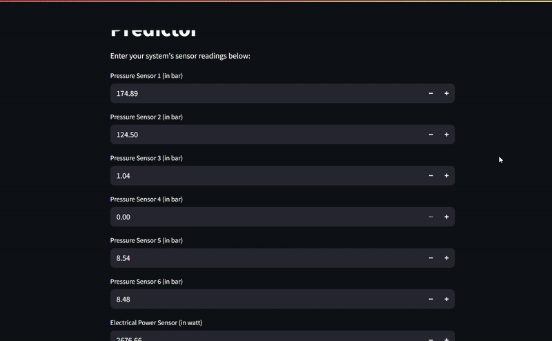

# Hydraulic System Maintenance Predictor 💧🔧🧑‍🔧
[](https://github.com/Sajid030/image-caption-generator/blob/master/LICENSE.md)
[](https://www.python.org/)


[](https://www.streamlit.io/)

## 📑 Table of Contents
- [🚀 Demo](#-demo)
- [📖 Overview](#-overview)
- [📊 About the Dataset](#-about-the-dataset)
- [⚙️ Installation](#️-installation)
- [🌐 Deployment on Streamlit](#-deployment-on-streamlit)
- [📁 Directory Tree](#-directory-tree)
- [🐞 Bug / Feature Request](#-bug--feature-request)
- [🔮 Future Scope](#-future-scope)

---

## 🚀 Demo
- Link: https://predict-maintenance.streamlit.app/

`Note:` If the website link provided above is not working, it might mean that the deployment has been stopped or there are technical issues. We apologize for any inconvenience.

- Please consider giving a ⭐ to the repository if you find this app useful.
- A quick preview of the **Hydraulic System Predictive Maintenance** app:



## 📖 Overview
This project is a machine learning-powered web app that predicts whether various hydraulic system components need maintenance based on real-time sensor inputs. It uses pre-trained models to assess the condition of the cooler, valve, pump, and hydraulic accumulator.

## 📊 About the Dataset
The dataset used is from a hydraulic test rig, including sensor readings such as:
- Pressure sensors (PS1–PS6)
- Electrical power sensor (EPS1)
- Flow sensors (FS1, FS2)
- Temperature sensors (TS1–TS4)
- Volume, cooling, and system efficiency
- Stability flag and maintenance condition labels

Target prediction labels:
- Cooler condition
- Valve condition
- Internal pump leakage
- Hydraulic accumulator condition

For more details, visit the [dataset](https://www.kaggle.com/datasets/mayank1897/condition-monitoring-of-hydraulic-systems?select=description.txt)

## ⚙️ Installation
This project is written in Python 3.11.11. If you don't have Python installed, you can download it from the [official website](https://www.python.org/downloads/). If you have an older version of Python, you can upgrade it using the pip package manager, which should be already installed if you have Python 2 >=2.7.9 or Python 3 >=3.4 on your system.
To install the required packages and libraries, you can use pip and the provided requirements.txt file. First, clone this repository to your local machine using the following command:
```
https://github.com/Sajid030/Hydraulic-System-Predictive-Maintenance.git
```
Once you have cloned the repository, navigate to the project directory and run the following command in your terminal or command prompt:
```bash
pip install -r requirements.txt
```
This will install all the necessary packages and libraries needed to run the project.

## 🌐 Deployement on Streamlit

1. Create an account on Streamlit Sharing.
2. Fork this repository to your GitHub account.
3. Log in to Streamlit Sharing and create a new app.
4. Connect your GitHub account to Streamlit Sharing and select this repository.
5. Set the following configuration variables in the Streamlit Sharing dashboard:
```
[server]
headless = true
port = $PORT
enableCORS = false
```
6. Click on "Deploy app" to deploy the app on Streamlit Sharing.

## 📁 Directory Tree

```
│   app.py
│   Hydraulics_System.ipynb
│   LICENSE.md
│   README.md
│   requirements.txt
│   scaler.pkl
│
├───models
│       accumulator_model.pkl
│       cooler_model.pkl
│       pump_model.pkl
│       valve_model.pkl
│
└───resource
        demo.gif
```

## 🐞 Bug / Feature Request

If you encounter any bugs or issues with the loan status predictor app, please let me know by opening an issue on my [GitHub repository](https://github.com/Sajid030/Hydraulic-System-Predictive-Maintenance/issues). Be sure to include the details of your query and the expected results. Your feedback is valuable in helping me improve the app for all users. Thank you for your support!

## 🔮 Future Scope

1. Incorporate time-series sensor data
2. Add real-time sensor integration via API
3. Predict system failure probability
4. Build mobile-friendly UI
